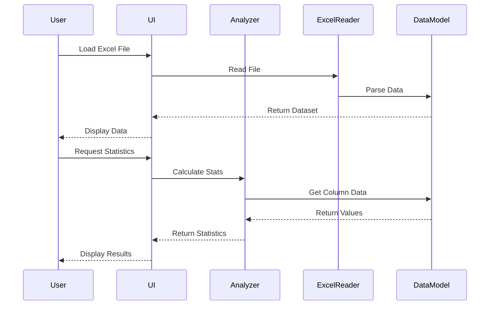

# Dokumen Design: Aplikasi Analisis Data Excel

## Overview

Aplikasi Analisis Data Excel adalah aplikasi berbasis command-line atau GUI yang memungkinkan pengguna untuk membaca, menganalisis, dan memproses data dari file Excel (.xlsx). Aplikasi ini menggunakan library untuk parsing Excel, menyediakan berbagai operasi analisis data, dan menghasilkan output yang dapat diekspor.

Arsitektur aplikasi mengikuti pola layered architecture dengan pemisahan yang jelas antara:
- **Presentation Layer**: Interface pengguna (CLI atau GUI)
- **Business Logic Layer**: Logika analisis data dan operasi
- **Data Access Layer**: Pembacaan dan penulisan file Excel

## Architecture

### High-Level Architecture

```
┌─────────────────────────────────────────┐
│      Presentation Layer (UI)            │
│  - CLI Interface / GUI Interface        │
│  - Input Validation                     │
│  - Output Formatting                    │
└──────────────────┬──────────────────────┘
                   │
┌──────────────────▼──────────────────────┐
│      Business Logic Layer               │
│  - Data Analyzer                        │
│  - Statistical Calculator               │
│  - Filter Engine                        │
│  - Sort Engine                          │
│  - Search Engine                        │
│  - Validation Engine                    │
└──────────────────┬──────────────────────┘
                   │
┌──────────────────▼──────────────────────┐
│      Data Access Layer                  │
│  - Excel Reader                         │
│  - Excel Writer                         │
│  - Data Model                           │
└─────────────────────────────────────────┘
```

### Component Interaction Flow



## Components and Interfaces

### 1. Excel Reader Component

**Tanggung Jawab:**
- Membaca file Excel (.xlsx)
- Parsing worksheet dan cell data
- Mendeteksi tipe data (number, text, date, boolean)
- Menangani error pembacaan file

**Interface:**
```python
class ExcelReader:
    def read_file(file_path: str) -> Workbook:
        """Membaca file Excel dan mengembalikan objek Workbook"""
        pass
    
    def get_worksheets(workbook: Workbook) -> List[str]:
        """Mengembalikan daftar nama worksheet"""
        pass
    
    def read_worksheet(workbook: Workbook, sheet_name: str) -> DataFrame:
        """Membaca worksheet tertentu dan mengembalikan DataFrame"""
        pass
    
    def detect_column_types(dataframe: DataFrame) -> Dict[str, str]:
        """Mendeteksi tipe data untuk setiap kolom"""
        pass
```

### 2. Data Model Component

**Tanggung Jawab:**
- Menyimpan data dalam struktur yang efisien
- Menyediakan akses ke data
- Mengelola metadata (nama kolom, tipe data, dll)

**Interface:**
```python
class Dataset:
    def __init__(data: DataFrame, metadata: Dict):
        """Inisialisasi dataset dengan data dan metadata"""
        pass
    
    def get_column(column_name: str) -> List:
        """Mengembalikan data dari kolom tertentu"""
        pass
    
    def get_row(row_index: int) -> Dict:
        """Mengembalikan data dari baris tertentu"""
        pass
    
    def get_column_names() -> List[str]:
        """Mengembalikan daftar nama kolom"""
        pass
    
    def get_row_count() -> int:
        """Mengembalikan jumlah baris"""
        pass
    
    def get_column_count() -> int:
        """Mengembalikan jumlah kolom"""
        pass
    
    def get_column_type(column_name: str) -> str:
        """Mengembalikan tipe data kolom"""
        pass
```

### 3. Statistical Calculator Component

**Tanggung Jawab:**
- Menghitung statistik deskriptif
- Validasi bahwa kolom adalah numerik
- Menangani nilai null/kosong

**Interface:**
```python
class StatisticalCalculator:
    def calculate_mean(values: List[float]) -> float:
        """Menghitung rata-rata"""
        pass
    
    def calculate_median(values: List[float]) -> float:
        """Menghitung median"""
        pass
    
    def calculate_mode(values: List[float]) -> List[float]:
        """Menghitung modus (bisa lebih dari satu)"""
        pass
    
    def calculate_std_dev(values: List[float]) -> float:
        """Menghitung standar deviasi"""
        pass
    
    def calculate_min_max(values: List[float]) -> Tuple[float, float]:
        """Menghitung nilai minimum dan maksimum"""
        pass
    
    def calculate_sum(values: List[float]) -> float:
        """Menghitung jumlah total"""
        pass
    
    def get_descriptive_stats(values: List[float]) -> Dict:
        """Mengembalikan semua statistik deskriptif"""
        pass
```

### 4. Filter Engine Component

**Tanggung Jawab:**
- Memfilter data berdasarkan kriteria
- Mendukung berbagai operator (equals, greater than, less than, contains)
- Mendukung multiple filter dengan AND logic

**Interface:**
```python
class FilterEngine:
    def filter_equals(dataset: Dataset, column: str, value: Any) -> Dataset:
        """Filter baris dimana kolom sama dengan nilai"""
        pass
    
    def filter_greater_than(dataset: Dataset, column: str, value: float) -> Dataset:
        """Filter baris dimana kolom lebih besar dari nilai"""
        pass
    
    def filter_less_than(dataset: Dataset, column: str, value: float) -> Dataset:
        """Filter baris dimana kolom lebih kecil dari nilai"""
        pass
    
    def filter_contains(dataset: Dataset, column: str, text: str) -> Dataset:
        """Filter baris dimana kolom mengandung teks"""
        pass
    
    def apply_multiple_filters(dataset: Dataset, filters: List[Filter]) -> Dataset:
        """Menerapkan multiple filter dengan AND logic"""
        pass
```

### 5. Sort Engine Component

**Tanggung Jawab:**
- Mengurutkan data berdasarkan kolom
- Mendukung ascending dan descending
- Menangani berbagai tipe data (numeric, text, date)

**Interface:**
```python
class SortEngine:
    def sort_by_column(dataset: Dataset, column: str, ascending: bool = True) -> Dataset:
        """Mengurutkan dataset berdasarkan kolom"""
        pass
    
    def sort_numeric(dataset: Dataset, column: str, ascending: bool) -> Dataset:
        """Mengurutkan kolom numerik"""
        pass
    
    def sort_text(dataset: Dataset, column: str, ascending: bool) -> Dataset:
        """Mengurutkan kolom teks secara alfabetis"""
        pass
    
    def sort_date(dataset: Dataset, column: str, ascending: bool) -> Dataset:
        """Mengurutkan kolom tanggal secara kronologis"""
        pass
```

### 6. Search Engine Component

**Tanggung Jawab:**
- Mencari kata kunci di seluruh dataset
- Mengembalikan baris yang cocok
- Menyorot hasil pencarian

**Interface:**
```python
class SearchEngine:
    def search(dataset: Dataset, keyword: str) -> SearchResult:
        """Mencari keyword di semua kolom"""
        pass
    
    def search_in_column(dataset: Dataset, column: str, keyword: str) -> SearchResult:
        """Mencari keyword di kolom tertentu"""
        pass
    
    def highlight_matches(text: str, keyword: str) -> str:
        """Menyorot keyword dalam teks"""
        pass
```

### 7. Validation Engine Component

**Tanggung Jawab:**
- Mengidentifikasi data kosong atau null
- Menghitung kelengkapan data
- Mengidentifikasi data tidak valid

**Interface:**
```python
class ValidationEngine:
    def find_empty_cells(dataset: Dataset) -> Dict[str, List[int]]:
        """Mengembalikan posisi cell kosong per kolom"""
        pass
    
    def calculate_completeness(dataset: Dataset) -> Dict[str, float]:
        """Menghitung persentase kelengkapan per kolom"""
        pass
    
    def find_incomplete_rows(dataset: Dataset) -> List[int]:
        """Mengembalikan index baris dengan data tidak lengkap"""
        pass
    
    def validate_data_types(dataset: Dataset) -> Dict[str, List[int]]:
        """Mengidentifikasi baris dengan tipe data tidak sesuai"""
        pass
```

### 8. Excel Writer Component

**Tanggung Jawab:**
- Menulis dataset ke file Excel
- Menulis hasil statistik ke file
- Mempertahankan format data

**Interface:**
```python
class ExcelWriter:
    def write_dataset(dataset: Dataset, file_path: str) -> bool:
        """Menulis dataset ke file Excel"""
        pass
    
    def write_statistics(stats: Dict, file_path: str) -> bool:
        """Menulis hasil statistik ke file"""
        pass
    
    def export_to_csv(dataset: Dataset, file_path: str) -> bool:
        """Export dataset ke format CSV"""
        pass
```

### 9. UI Component (CLI/GUI)

**Tanggung Jawab:**
- Menerima input dari pengguna
- Menampilkan output
- Menangani interaksi pengguna
- Menampilkan progress dan error messages

**Interface:**
```python
class UserInterface:
    def display_menu() -> None:
        """Menampilkan menu utama"""
        pass
    
    def get_file_path() -> str:
        """Meminta input file path dari pengguna"""
        pass
    
    def display_data(dataset: Dataset, page: int = 1, page_size: int = 100) -> None:
        """Menampilkan data dengan pagination"""
        pass
    
    def display_statistics(stats: Dict) -> None:
        """Menampilkan hasil statistik"""
        pass
    
    def display_error(message: str) -> None:
        """Menampilkan pesan error"""
        pass
    
    def display_success(message: str) -> None:
        """Menampilkan pesan sukses"""
        pass
    
    def show_loading(message: str) -> None:
        """Menampilkan indikator loading"""
        pass
    
    def get_user_confirmation(message: str) -> bool:
        """Meminta konfirmasi dari pengguna"""
        pass
```

## Data Models

### Workbook Model
```python
class Workbook:
    file_path: str
    worksheets: List[Worksheet]
    metadata: Dict
```

### Worksheet Model
```python
class Worksheet:
    name: str
    data: DataFrame
    row_count: int
    column_count: int
```

### Dataset Model
```python
class Dataset:
    data: DataFrame  # Pandas DataFrame atau struktur serupa
    column_names: List[str]
    column_types: Dict[str, str]  # {column_name: type}
    row_count: int
    column_count: int
    source_file: str
    source_worksheet: str
```

### Filter Model
```python
class Filter:
    column: str
    operator: str  # 'equals', 'gt', 'lt', 'contains'
    value: Any
```

### SearchResult Model
```python
class SearchResult:
    matching_rows: List[int]
    total_matches: int
    highlighted_data: List[Dict]
```

### Statistics Model
```python
class Statistics:
    column_name: str
    mean: float
    median: float
    mode: List[float]
    std_dev: float
    min_value: float
    max_value: float
    sum_value: float
    count: int
```

## Correctness Properties

*Property adalah karakteristik atau perilaku yang harus berlaku untuk semua eksekusi sistem yang valid - pada dasarnya, pernyataan formal tentang apa yang harus dilakukan sistem. Property berfungsi sebagai jembatan antara spesifikasi yang dapat dibaca manusia dan jaminan kebenaran yang dapat diverifikasi mesin.*


### Property 1: Excel Reading Round-Trip
*For any* valid Excel file with multiple worksheets, reading the file should correctly load all worksheets, and reading a specific worksheet should return all the data from that worksheet.
**Validates: Requirements 1.1, 1.2, 1.3**

### Property 2: Data Display Completeness
*For any* dataset, when displayed, the output should include all column names, all rows, correct row count, and correct column count.
**Validates: Requirements 2.1, 2.2, 2.5**

### Property 3: Column Type Detection Accuracy
*For any* dataset with mixed data types, the detected column types should correctly identify numeric, text, date, and boolean columns.
**Validates: Requirements 2.3**

### Property 4: Statistical Calculations Correctness
*For any* list of numeric values, the calculated mean, median, mode, standard deviation, min, max, and sum should match the mathematically correct values within acceptable floating-point precision.
**Validates: Requirements 3.1, 3.2, 3.3, 3.4, 3.5, 3.6**

### Property 5: Filter Correctness
*For any* dataset and filter criteria (equals, greater than, less than, contains), all rows in the filtered result should satisfy the filter condition, and no rows that satisfy the condition should be excluded.
**Validates: Requirements 4.1, 4.2, 4.3, 4.4, 4.5**

### Property 6: Multiple Filters AND Logic
*For any* dataset and multiple filter criteria, the filtered result should contain only rows that satisfy ALL filter conditions (AND logic).
**Validates: Requirements 4.6**

### Property 7: Filter Removal Round-Trip
*For any* dataset, applying a filter and then removing it should return the original dataset unchanged.
**Validates: Requirements 4.7**

### Property 8: Sort Order Correctness
*For any* dataset and column, sorting by that column (ascending or descending) should result in a dataset where consecutive values are in the correct order according to the sort direction and data type (numeric, alphabetic, or chronological).
**Validates: Requirements 5.1, 5.2, 5.3, 5.4, 5.5, 5.6**

### Property 9: Search Completeness
*For any* dataset and search keyword, all returned rows should contain the keyword in at least one column, and all rows containing the keyword should be returned.
**Validates: Requirements 6.1, 6.2**

### Property 10: Search Result Count Accuracy
*For any* dataset and search keyword, the reported count of search results should equal the actual number of rows containing the keyword.
**Validates: Requirements 6.4**

### Property 11: Search Highlighting
*For any* text and keyword, the highlighted output should contain the keyword and include highlighting markers around it.
**Validates: Requirements 6.3**

### Property 12: Export-Import Round-Trip
*For any* dataset (including filtered or sorted data), exporting to Excel and then importing the exported file should produce a dataset equivalent to the original.
**Validates: Requirements 7.1, 7.3**

### Property 13: Statistics Export Round-Trip
*For any* statistics result, exporting to file and then reading the file should preserve all statistical values.
**Validates: Requirements 7.2**

### Property 14: Empty Cell Identification
*For any* dataset with empty or null cells, the validation engine should identify all empty cells and report the correct count per column.
**Validates: Requirements 8.1, 8.2**

### Property 15: Incomplete Row Identification
*For any* dataset, all rows identified as incomplete should have at least one empty cell, and all rows with at least one empty cell should be identified as incomplete.
**Validates: Requirements 8.3**

### Property 16: Completeness Percentage Accuracy
*For any* dataset, the calculated completeness percentage for each column should equal (non-empty cells / total cells) * 100.
**Validates: Requirements 8.4**

### Property 17: Invalid Data Identification
*For any* dataset with type mismatches, all rows with data that doesn't match the expected column type should be identified as invalid.
**Validates: Requirements 8.5**

### Property 18: Confirmation Before Destructive Actions
*For any* destructive action (delete, overwrite), the confirmation function should be called before the action is executed.
**Validates: Requirements 9.5**

## Error Handling

### Error Categories

1. **File Access Errors**
   - File not found
   - Permission denied
   - Corrupted file
   - Unsupported format

2. **Data Processing Errors**
   - Invalid data type for operation
   - Empty dataset
   - Column not found
   - Invalid filter criteria

3. **Export Errors**
   - Write permission denied
   - Disk space full
   - Invalid file path

4. **Validation Errors**
   - Non-numeric column for statistical operations
   - Invalid sort column
   - Invalid filter operator

### Error Handling Strategy

**Principle**: Fail fast with descriptive error messages

**Implementation**:
```python
class ExcelAnalyzerError(Exception):
    """Base exception untuk aplikasi"""
    pass

class FileReadError(ExcelAnalyzerError):
    """Error saat membaca file"""
    pass

class DataProcessingError(ExcelAnalyzerError):
    """Error saat memproses data"""
    pass

class ValidationError(ExcelAnalyzerError):
    """Error saat validasi data"""
    pass

class ExportError(ExcelAnalyzerError):
    """Error saat export data"""
    pass
```

**Error Handling Rules**:
1. Semua error harus memiliki pesan yang deskriptif dalam Bahasa Indonesia
2. Error harus mencakup konteks (nama file, nama kolom, dll)
3. Error harus di-log untuk debugging
4. User-facing error messages harus ramah dan memberikan saran solusi
5. System errors harus di-catch dan di-convert ke user-friendly messages

**Example Error Messages**:
- "File 'data.xlsx' tidak ditemukan. Pastikan path file benar."
- "Kolom 'Nama' bukan kolom numerik. Statistik hanya dapat dihitung untuk kolom numerik."
- "Gagal menyimpan file ke 'output.xlsx'. Pastikan Anda memiliki izin menulis."

## Testing Strategy

### Dual Testing Approach

Aplikasi ini akan menggunakan kombinasi unit testing dan property-based testing untuk memastikan kebenaran dan keandalan:

**Unit Tests**: Untuk contoh spesifik, edge cases, dan kondisi error
- Test dengan file Excel contoh yang sudah diketahui hasilnya
- Test edge cases seperti dataset kosong, single row, single column
- Test error handling untuk berbagai kondisi error
- Test integrasi antar komponen

**Property Tests**: Untuk memverifikasi properties universal di semua input
- Test dengan data yang di-generate secara acak
- Verifikasi bahwa properties correctness berlaku untuk semua input
- Minimum 100 iterasi per property test
- Setiap property test harus reference design property-nya

### Property-Based Testing Configuration

**Library**: Akan menggunakan library property-based testing sesuai bahasa implementasi:
- Python: `hypothesis`
- TypeScript/JavaScript: `fast-check`
- Java: `jqwik`

**Configuration**:
- Minimum 100 iterations per test
- Setiap test harus di-tag dengan format: **Feature: excel-data-analyzer, Property {number}: {property_text}**
- Setiap correctness property harus diimplementasikan sebagai SATU property-based test

**Test Organization**:
```
tests/
├── unit/
│   ├── test_excel_reader.py
│   ├── test_statistical_calculator.py
│   ├── test_filter_engine.py
│   ├── test_sort_engine.py
│   ├── test_search_engine.py
│   ├── test_validation_engine.py
│   └── test_excel_writer.py
├── property/
│   ├── test_properties_reading.py
│   ├── test_properties_statistics.py
│   ├── test_properties_filtering.py
│   ├── test_properties_sorting.py
│   ├── test_properties_search.py
│   ├── test_properties_export.py
│   └── test_properties_validation.py
└── integration/
    └── test_end_to_end.py
```

### Test Coverage Goals

- Unit test coverage: minimum 80%
- Property test coverage: semua correctness properties harus diimplementasikan
- Integration test: minimal 1 end-to-end test per requirement
- Edge case coverage: semua edge cases yang diidentifikasi harus di-test

### Testing Best Practices

1. **Isolasi**: Setiap test harus independen dan tidak bergantung pada test lain
2. **Repeatability**: Test harus menghasilkan hasil yang sama setiap kali dijalankan
3. **Fast Execution**: Unit tests harus cepat (< 1 detik per test)
4. **Clear Assertions**: Setiap test harus memiliki assertion yang jelas dan deskriptif
5. **Test Data**: Gunakan test data yang representatif dan mencakup berbagai skenario
6. **Mocking**: Mock external dependencies (file system, dll) untuk unit tests
7. **Property Test Generators**: Buat generators yang menghasilkan data valid dan edge cases

## Implementation Notes

### Technology Stack Recommendations

**Backend/Core Logic**:
- Python dengan pandas untuk data manipulation (recommended untuk data analysis)
- TypeScript/Node.js dengan libraries seperti xlsx, papaparse
- Java dengan Apache POI untuk Excel processing

**Excel Processing Libraries**:
- Python: `openpyxl` atau `pandas` dengan `xlrd`/`xlsxwriter`
- TypeScript: `xlsx` (SheetJS)
- Java: Apache POI

**UI Options**:
1. **CLI**: Menggunakan argparse (Python), commander (Node.js), atau picocli (Java)
2. **GUI**: Menggunakan tkinter (Python), Electron (TypeScript), atau JavaFX (Java)
3. **Web**: React/Vue frontend dengan REST API backend

### Performance Considerations

1. **Lazy Loading**: Untuk file besar, load data secara lazy atau dalam chunks
2. **Caching**: Cache hasil perhitungan statistik untuk menghindari re-computation
3. **Indexing**: Gunakan indexing untuk operasi search dan filter yang cepat
4. **Streaming**: Untuk export file besar, gunakan streaming write
5. **Memory Management**: Monitor memory usage dan cleanup resources setelah digunakan

### Security Considerations

1. **Input Validation**: Validasi semua input dari user (file paths, filter values, dll)
2. **Path Traversal**: Prevent path traversal attacks saat membaca/menulis file
3. **File Size Limits**: Batasi ukuran file yang dapat diproses untuk mencegah DoS
4. **Sanitization**: Sanitize data sebelum display untuk mencegah injection attacks
5. **Error Messages**: Jangan expose sensitive information dalam error messages

### Extensibility

Design ini memungkinkan extensibility untuk fitur-fitur masa depan:
- **Plugin System**: Untuk menambahkan custom analysis functions
- **Custom Visualizations**: Untuk menambahkan charts dan graphs
- **Data Transformation**: Untuk menambahkan operasi transformasi data
- **Multiple File Formats**: Untuk mendukung CSV, JSON, database exports
- **Collaboration Features**: Untuk sharing dan collaborative analysis
